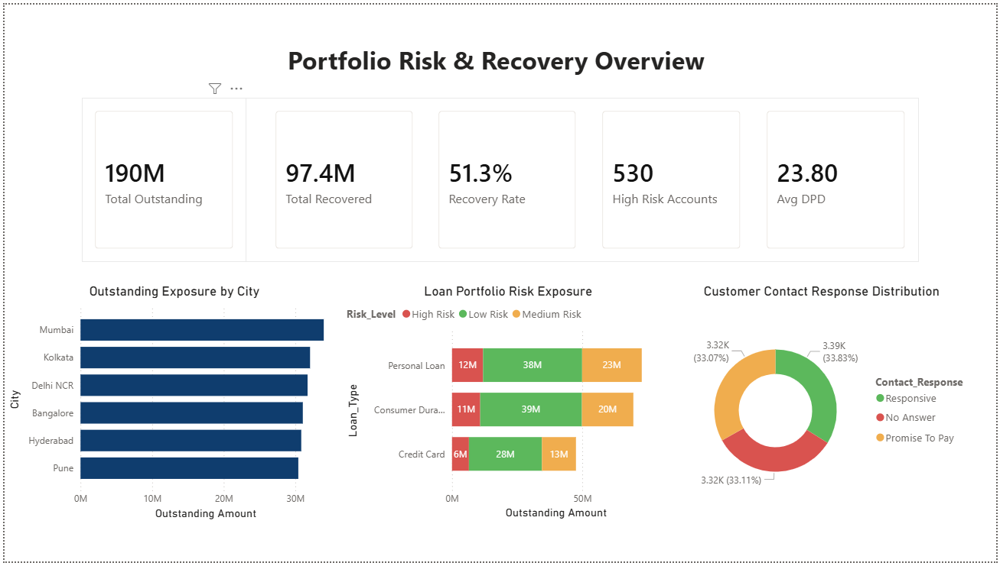
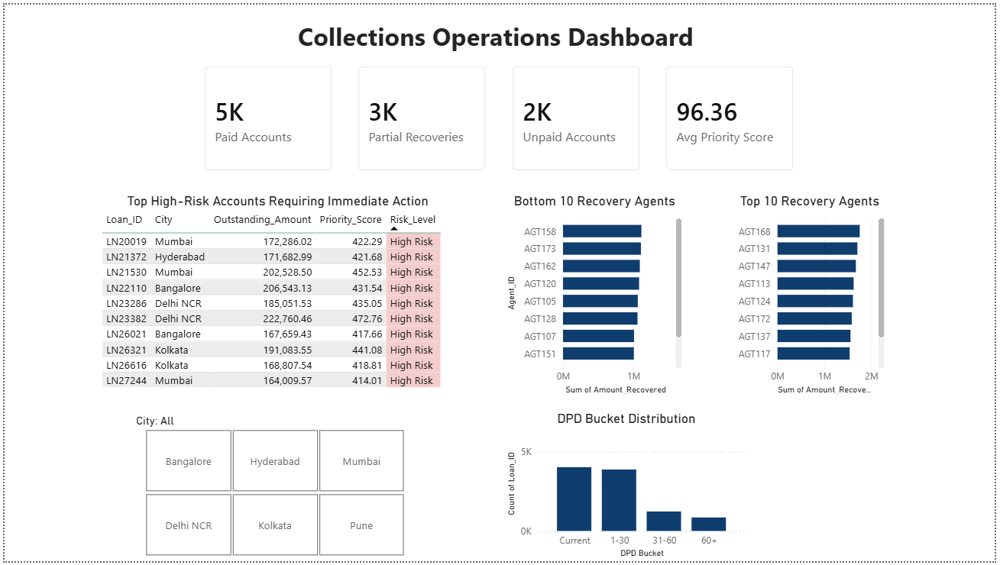

# Credit Collections Prioritization Engine

## About The Project

This project was built to simulate how collections and recovery teams monitor overdue loan accounts and prioritize recovery actions.

Using Python, MySQL, and Power BI, I created a collections analytics workflow that tracks outstanding balances, recovery performance, delinquency severity, customer response behavior, and recovery agent efficiency.

The goal was to build a business-oriented dashboard instead of a generic analytics project, with a stronger focus on finance and collections operations.

---

## What This Project Covers

- Portfolio outstanding analysis
- Recovery tracking
- High-risk account identification
- DPD (Days Past Due) analysis
- Customer response monitoring
- Recovery agent performance analysis
- Collections prioritization logic

---

## Tools Used

- Python
- Pandas
- MySQL
- Power BI
- Jupyter Notebook

---

## Dashboards Included

### Executive Overview

This dashboard focuses on portfolio-level monitoring and recovery performance.

It includes:
- Total outstanding exposure
- Recovery rate
- High-risk account tracking
- Portfolio risk segmentation
- Customer contact response analysis
- City-wise exposure analysis

---

### Collections Operations Dashboard

This dashboard focuses on operational collections monitoring.

It includes:
- High-priority delinquent accounts
- Top recovery agents
- Bottom recovery agents
- DPD bucket distribution
- Collections performance tracking

---

## Feature Engineering

A custom Priority Score was created using:

- Outstanding Amount
- Days Past Due
- Missed EMIs
- Customer Contact Response

Based on this score, accounts were categorized into:
- High Risk
- Medium Risk
- Low Risk

---

## SQL Concepts Used

- Joins
- Aggregations
- CASE Statements
- GROUP BY
- Sorting & Filtering
- Business KPI Queries

---

## Python Concepts Used

- Data Cleaning
- Feature Engineering
- Functions
- Conditional Logic
- Mapping
- CSV Export

---

## Power BI Concepts Used

- KPI Cards
- DAX Measures
- Conditional Formatting
- Slicers
- Interactive Dashboards
- Operational Reporting

---

## Project Structure

Credit-Collections-Prioritization-Engine/

├── data/

│ ├── customers_raw.csv

│ ├── loans_raw.csv

│ ├── collections_status_raw.csv

│ ├── analytics_dataset.csv

│

├── notebooks/

├── sql/

├── powerbi/

├── screenshots/

│ ├── executive_overview.png

│ ├── collections_operations.png

│

├── README.md

├── requirements.txt

└── .gitignore

---

## Project Outcome

This project helped me understand how collections and recovery teams analyze delinquent accounts, monitor recovery performance, and prioritize operational actions using data analytics tools.

---

## Author

Anas Jamal
